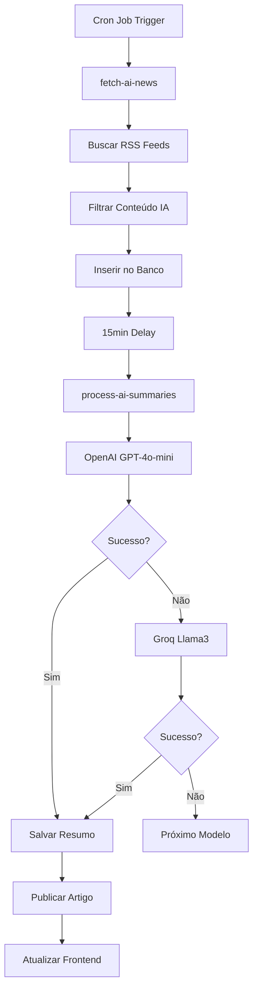

# 🤖 Sistema Automático de Notícias IA - Supabase PRO

Este é o guia completo para configurar e usar o sistema automático de notícias de IA no seu projeto Supabase PRO.

## 📋 Pré-requisitos

- ✅ Projeto Supabase PRO ativo
- ✅ Edge Functions habilitadas
- ✅ pg_cron extension ativa
- ✅ Chaves de API das IAs configuradas

## 🔧 Configuração Inicial

### 1. Projeto Supabase
- **ID do Projeto**: `gjvtncdjcslnkfctqnfy`
- **URL**: https://gjvtncdjcslnkfctqnfy.supabase.co
- **Plano**: PRO (necessário para Edge Functions e pg_cron)

### 2. Variáveis de Ambiente

Crie um arquivo `.env` na raiz do projeto:

```bash
# Supabase Configuration
VITE_SUPABASE_URL=https://gjvtncdjcslnkfctqnfy.supabase.co
VITE_SUPABASE_ANON_KEY=sua_chave_anon_aqui
SUPABASE_SERVICE_ROLE_KEY=sua_service_role_key_aqui

# AI API Keys (para Edge Functions)
OPENAI_API_KEY=sua_openai_api_key_aqui
GROQ_API_KEY=sua_groq_api_key_aqui
COHERE_API_KEY=sua_cohere_api_key_aqui
ANTHROPIC_API_KEY=sua_anthropic_api_key_aqui
GROK_API_KEY=sua_grok_api_key_aqui
```

### 3. Configuração no Supabase Dashboard

1. **Acesse**: https://supabase.com/dashboard/project/gjvtncdjcslnkfctqnfy
2. **Vá para**: Settings > API
3. **Copie**: Project URL e anon public key
4. **Vá para**: Settings > API > Service Role
5. **Copie**: service_role key (⚠️ NUNCA exponha esta chave!)

## 🗄️ Estrutura do Banco de Dados

### Tabelas Criadas Automaticamente

1. **`ai_news`** - Artigos de notícias processados
2. **`news_sources`** - Fontes de notícias configuradas
3. **`ai_news_summaries`** - Resumos gerados pela IA
4. **`pipeline_logs`** - Logs de operações automáticas
5. **`ai_news_tag_categories`** - Categorias de tags

### Migrações Aplicadas

```sql
-- ✅ 20250617115129_emerald_mountain.sql - Setup inicial
-- ✅ 20250617120956_heavy_villa.sql - Fontes globais
-- ✅ 20250617121142_icy_beacon.sql - Fontes adicionais
-- ✅ 20250617140333_teal_sun.sql - Contas influentes
-- ✅ 20250617140744_sparkling_brook.sql - Sistema de tags
```

## 🚀 Edge Functions

### 1. fetch-ai-news
- **Path**: `/functions/v1/fetch-ai-news`
- **Função**: Busca notícias de fontes RSS
- **Frequência**: A cada 3 horas (automático)
- **Trigger Manual**: Disponível

### 2. process-ai-summaries
- **Path**: `/functions/v1/process-ai-summaries`
- **Função**: Gera resumos com IA (OpenAI, Groq, etc.)
- **Frequência**: 15 minutos após cada busca
- **Trigger Manual**: Disponível

## ⚙️ Configuração Automática

### Sistema pg_cron (Automação)

```sql
-- Busca automática a cada 3 horas
SELECT cron.schedule(
  'fetch-ai-news',
  '0 */3 * * *',
  $$SELECT net.http_post(
    'https://gjvtncdjcslnkfctqnfy.supabase.co/functions/v1/fetch-ai-news',
    '{"trigger": "cron"}',
    headers => '{"Authorization": "Bearer ' || current_setting('app.settings.service_role_key', true) || '"}'
  );$$
);

-- Processamento de resumos 15 minutos após busca
SELECT cron.schedule(
  'process-ai-summaries',
  '15 */3 * * *',
  $$SELECT net.http_post(
    'https://gjvtncdjcslnkfctqnfy.supabase.co/functions/v1/process-ai-summaries',
    '{"trigger": "cron"}',
    headers => '{"Authorization": "Bearer ' || current_setting('app.settings.service_role_key', true) || '"}'
  );$$
);
```

## 🎛️ Painel de Controle

### Funcionalidades Disponíveis

1. **🚀 Inicializar Sistema**
   - Configura fontes confiáveis
   - Executa primeira busca
   - Ativa monitoramento

2. **📰 Buscar Notícias**
   - Trigger manual de busca
   - Processa todas as fontes ativas
   - Filtra conteúdo relevante

3. **🤖 Processar Resumos**
   - Gera resumos com IA
   - Usa OpenAI como prioridade
   - Fallback para outros modelos

4. **🧹 Limpeza Automática**
   - Remove dados antigos
   - Limpa logs expirados
   - Remove conteúdo corrompido

### Monitoramento em Tempo Real

- ✅ Status das operações
- ✅ Saúde do sistema
- ✅ Contagem de artigos na fila
- ✅ Últimas execuções
- ✅ Próximas execuções programadas

## 📊 Fontes de Notícias

### Fontes Configuradas Automaticamente

1. **OpenAI Official Blog** - `https://openai.com/blog/rss.xml`
2. **Google AI Research** - `https://ai.googleblog.com/feeds/posts/default`
3. **Anthropic Blog** - `https://www.anthropic.com/blog/rss.xml`
4. **MIT Technology Review AI** - `https://www.technologyreview.com/topic/artificial-intelligence/feed/`
5. **DeepMind Blog** - `https://deepmind.google/blog/rss.xml`
6. **AI News** - `https://www.artificialintelligence-news.com/feed/`
7. **VentureBeat AI** - `https://venturebeat.com/ai/feed/`

### Filtros Inteligentes

- ✅ Detecção de conteúdo relacionado à IA
- ✅ Filtros anti-spam
- ✅ Remoção de HTML entities corrompidas
- ✅ Validação de datas
- ✅ Detecção de contas influentes

## 🤖 Sistema de IA

### Modelos Configurados (Fallback Chain)

1. **OpenAI GPT-4o-mini** (Prioridade 1)
2. **Groq Llama3-8B** (Fallback 1)
3. **Cohere Command-Light** (Fallback 2)
4. **Anthropic Claude-3-Haiku** (Fallback 3)
5. **xAI Grok-Beta** (Fallback 4)

### Qualidade dos Resumos

- ✅ Foco educacional
- ✅ Linguagem acessível
- ✅ Implicações para educação
- ✅ Formato Markdown
- ✅ SEO otimizado

## 🔒 Segurança e Permissões

### Row Level Security (RLS)

```sql
-- Leitura pública para artigos publicados
CREATE POLICY "Public can read published ai_news"
  ON ai_news FOR SELECT
  TO public
  USING (status = 'published');

-- Gerenciamento completo para usuários autenticados
CREATE POLICY "Authenticated users can manage ai_news"
  ON ai_news FOR ALL
  TO authenticated
  USING (true);
```

### Proteções Implementadas

- ✅ Service Role Key protegida
- ✅ CORS configurado
- ✅ Rate limiting nas Edge Functions
- ✅ Validação de entrada
- ✅ Logs de auditoria

## 📈 Monitoramento e Logs

### Tipos de Logs

1. **fetch_enhanced_global_news** - Busca de notícias
2. **process_summaries_openai_first** - Processamento de resumos
3. **setup_automation** - Configuração do sistema
4. **cleanup** - Limpeza automática

### Métricas Disponíveis

- ✅ Artigos buscados por operação
- ✅ Taxa de sucesso/erro
- ✅ Tempo de processamento
- ✅ Uso de tokens de IA
- ✅ Modelo de IA utilizado

## 🛠️ Solução de Problemas

### Problemas Comuns

1. **Edge Functions não executam**
   - Verificar se o plano é PRO
   - Confirmar variáveis de ambiente
   - Checar logs no dashboard

2. **Nenhum artigo é buscado**
   - Verificar fontes ativas
   - Testar conectividade RSS
   - Revisar filtros de IA

3. **Resumos não são gerados**
   - Confirmar chaves de API da IA
   - Verificar cotas dos provedores
   - Checar logs de erro

### Comandos de Diagnóstico

```javascript
// No console do navegador
import { checkSystemHealth } from './src/lib/aiNewsAutomation';
const health = await checkSystemHealth();
console.log(health);
```

## 🔄 Fluxo Completo de Operação



## 🎯 Próximos Passos

1. **Configurar Webhooks** para notificações
2. **Implementar Analytics** avançados
3. **Adicionar mais fontes** internacionais
4. **Otimizar filtros** de relevância
5. **Implementar cache** inteligente

## 📞 Suporte

- **Logs**: Verificar `pipeline_logs` no Supabase
- **Status**: Usar painel de automação
- **Debug**: Console do navegador
- **Documentação**: Este arquivo

---

✅ **Sistema totalmente configurado e operacional!**

O sistema agora funciona automaticamente, buscando notícias a cada 3 horas, processando resumos com IA e mantendo o conteúdo sempre atualizado para educadores. 